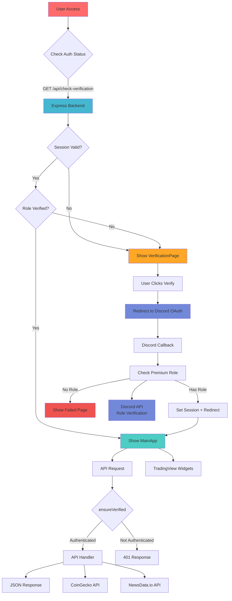
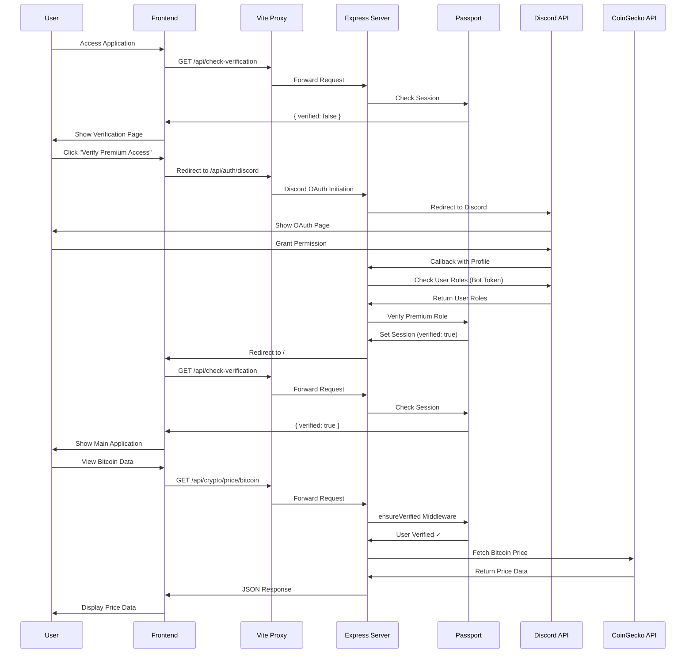

# CryptoSensei Authentication Flow Diagram



## Component Architecture with Authentication

```mermaid
graph LR
    subgraph "Frontend Authentication Layer"
        App[App.tsx<br/>Auth Gateway]
        AppContent[AppContent Component]
        VerifyPage[VerificationPage.tsx]
        VerifyBtn[VerifyButton.tsx]
        MainApp[MainApp.tsx<br/>Protected App]
    end

    subgraph "Protected Components"
        TradingView[TradingView.tsx]
        MarketAnalysis[MarketAnalysis.tsx]
        NewsPanel[NewsPanel.tsx]
        FeaturedCoins[FeaturedCoinsManager.tsx]
        AdvancedAnalysis[AdvancedAnalysis.tsx]
    end

    subgraph "Backend Authentication"
        PassportConfig[passport.ts<br/>Discord Strategy]
        AuthMiddleware[ensureVerified<br/>Middleware]
        SessionConfig[Express Session]
    end

    subgraph "Protected APIs"
        NewsAPI[/api/news/:crypto]
        PriceAPI[/api/crypto/price/:id]
        HistoryAPI[/api/crypto/history/:id]
    end

    subgraph "Auth Endpoints"
        AuthDiscord[/api/auth/discord]
        AuthCallback[/api/auth/discord/callback]
        CheckVerification[/api/check-verification]
        VerificationFailed[/api/verification-failed]
        AuthReset[/api/auth/reset]
    end

    %% Authentication Flow
    App --> AppContent
    AppContent --> VerifyPage
    AppContent --> MainApp
    VerifyPage --> VerifyBtn
    VerifyBtn --> AuthDiscord

    %% Protected App Flow
    MainApp --> TradingView
    MainApp --> MarketAnalysis
    MainApp --> NewsPanel
    MainApp --> FeaturedCoins
    MainApp --> AdvancedAnalysis

    %% Backend Protection
    AuthMiddleware --> NewsAPI
    AuthMiddleware --> PriceAPI
    AuthMiddleware --> HistoryAPI

    %% Authentication Backend
    PassportConfig --> AuthDiscord
    PassportConfig --> AuthCallback
    SessionConfig --> CheckVerification

    style App fill:#ff6b6b
    style MainApp fill:#4ecdc4
    style AuthMiddleware fill:#45b7d1
    style PassportConfig fill:#7289da
```

## Data Flow with Authentication


